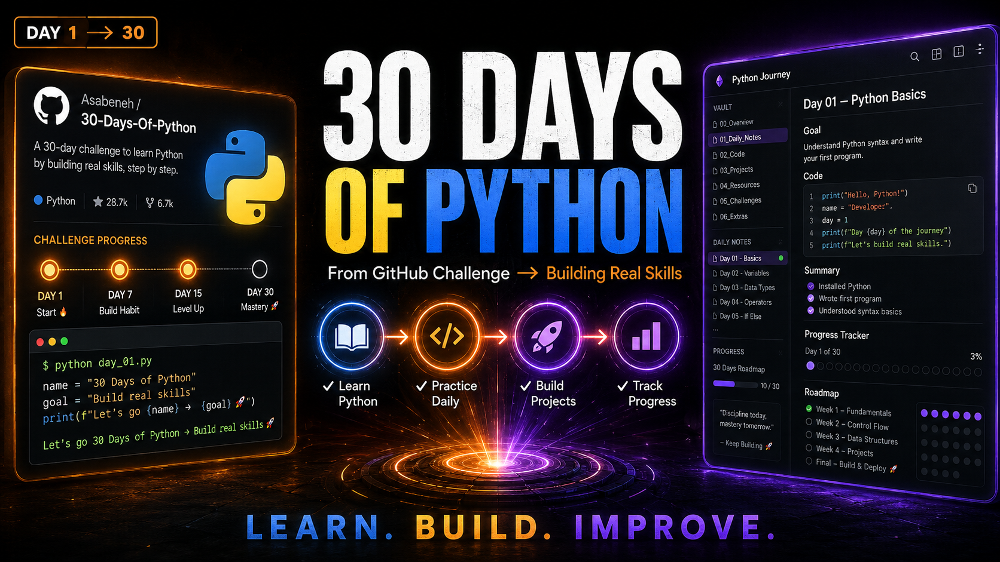

# 30 Days of Python 🐍

Working through [@Asabeneh](https://github.com/Asabeneh)'s [30-Days-Of-Python](https://github.com/Asabeneh/30-Days-Of-Python) challenge at my own pace.

I'm a finance professional transitioning toward data and AI. Python is the foundation. This repo is my honest, unfiltered learning log — no skipping, no faking progress.

---

## Progress

| Day | Topic | Status |
|-----|-------|--------|
| Day 01 | Introduction — Syntax, Data Types, Arithmetic | ✅ Done |
| Day 02 | Variables, Built-in Functions | ✅ Done |
| Day 03 | Operators | ⏳ |
| ... | ... | ... |

---

## Day 01 — Introduction

**What I covered:**
- Basic arithmetic operators: `+`, `-`, `*`, `/`, `**`, `%`, `//`
- Data types: int, float, complex, string, list, dict, set, tuple, bool
- Used `type()` to inspect values
- Calculated Euclidean distance using pure arithmetic

**File:** `Day01/Day1.py`

## Day 02 — Variables and Built-in Functions

**What I covered:**
- Declaring variables and assigning values (str, int, float, bool)
- Multiple assignment on a single line
- Built-in functions: `type()`, `len()`, `input()`, `float()`, `help()`
- All seven arithmetic operators applied to variables
- Calculated circle area and circumference from user input

**Files:** `Day02/Day2.py` · `Day02/Day02_Notes.md`

---

*Following the curriculum from [Asabeneh/30-Days-Of-Python](https://github.com/Asabeneh/30-Days-Of-Python). All solutions are my own work.*
